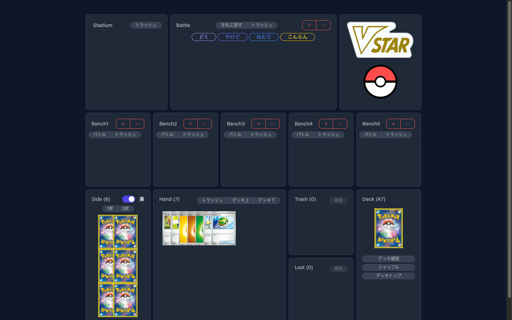
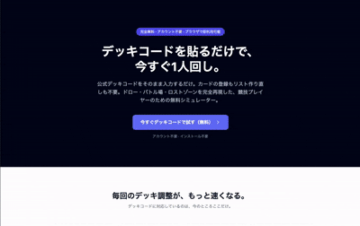
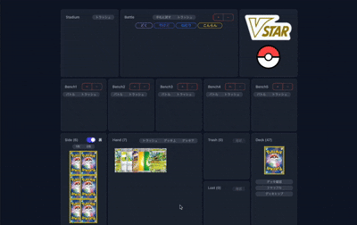
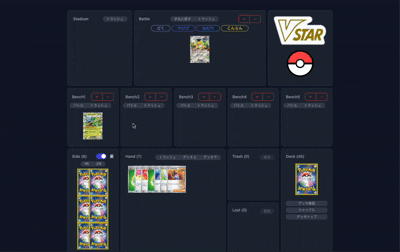
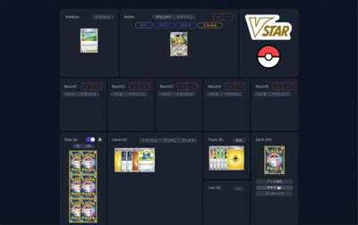

# PTCG Simulator

> **ポケモンカードゲーム（ポケカ）の1人回し・回し確認を、ブラウザだけで完結させる Web シミュレーター**
> デッキコードを入力するだけで、山札・手札・バトル場・ベンチ・サイド・トラッシュ・ロストゾーン・スタジアムをドラッグ&ドロップで操作できます。

<!-- TODO: ここにトップ画面（デッキコード入力 → ボード表示）の GIF もしくは静止画スクショを差し込む -->
<!-- 推奨: 起動直後の画面 & 実際にカードをドラッグしている様子のアニメーション GIF -->



## デモ

<!-- TODO: Cloudflare Workers にデプロイ後、公開 URL をここに差し込む -->

- 公開デモ: **（デプロイ後に URL を記載）**
- ローカル起動: `pnpm install && pnpm dev`

---

## 何を作ったのか

- **デッキコードを貼り付けると、即座にポケカの盤面を再現**する Web アプリ
- 山札シャッフル → 初手7枚ドロー → サイド6枚セットまで自動化
- 各ゾーン（手札・バトル場・ベンチ5枠・トラッシュ・ロスト・サイド・スタジアム）間をドラッグ&ドロップでカード移動
- ダメカン（ダメージカウンター）の加減算、カード詳細閲覧、トラッシュ／ロストの中身確認など、1人回しに必要な操作を一通り搭載

<!-- TODO: 主要操作（ドラッグ&ドロップでバトル場↔ベンチ、ダメカン操作、トラッシュ閲覧）を1つずつ GIF で並べる想定 -->

| 操作              | イメージ                                                                    |
| ----------------- | --------------------------------------------------------------------------- |
| デッキロード      |           |
| カード移動（DnD） |  |
| ダメカン操作      |      |

---

## なぜ作ったのか（背景・課題）

ポケモンカードの「1人回し」（デッキを1人で回してムーブや安定度を確認する作業）には、以下の課題があります。

1. **物理カードだと手間がかかる**
   - 実物を並べるのに場所と時間が必要。リモートワーク中や出先では気軽にできない。
2. **既存ツールは機能過多 or 対戦特化**
   - 公式系クライアントは対戦相手とのマッチングが前提で、「黙々と一人で回したい」ユースケースには重い。
   - 他ツールは広告・ログイン・古い UI などが障壁になりがち。
3. **「URL を共有するだけで同じ盤面を再現したい」需要**
   - 配信者・解説記事・友人同士の共有で、デッキコード1つから同じ状態を再現できる環境が欲しい。

そこで、**「デッキコードを貼るだけ、ブラウザ1枚で完結、ログイン不要」** というミニマムなコンセプトで、1人回し専用の軽量シミュレーターを自作しました。

---

## 技術選定理由

| レイヤ               | 採用技術                                                 | 選定理由                                                                                                                                                                 |
| -------------------- | -------------------------------------------------------- | ------------------------------------------------------------------------------------------------------------------------------------------------------------------------ |
| フレームワーク       | **SvelteKit 2 (Svelte 4)**                               | 学習コストが低く、DOM 更新が速い。SPA・SSR・API ルート・静的ホスティングまで1つで賄える。Svelte のリアクティビティが「カードの移動・枚数更新」のような UI と相性が良い。 |
| 状態管理             | **XState 4（Actor モデル）**                             | 山札・手札・バトル場など**ゾーンごとに独立した状態機械**を持ち、`sendParent` で親に通知する構造にフィット。状態遷移が視覚化でき、ゲームロジックのバグを抑えやすい。      |
| API フレームワーク   | **Hono**（SvelteKit の hooks に組み込み）                | 型安全な RPC クライアント（`hc<ApiRoute>`）を使えるため、サーバ ↔ クライアント間で型が通る。Cloudflare Workers との親和性も高い。                                        |
| バリデーション       | **Zod**                                                  | API 入力の型定義とランタイム検証を1つで両立。Hono とのバリデーション連携（`@hono/zod-validator`）が組み込みやすい。                                                      |
| UI / スタイリング    | **Tailwind CSS 3** + **Flowbite Svelte**                 | ポケカの盤面レイアウトはユーティリティクラスでの調整が多くなるため Tailwind が最適。モーダル・ボタン等は Flowbite Svelte で即利用。                                      |
| D&D                  | **svelte-dnd-action**                                    | Svelte 公式推奨レベルで安定しており、複数リスト間のカード移動がシンプルに書ける。                                                                                        |
| デプロイ             | **Cloudflare Workers**（`@sveltejs/adapter-cloudflare`） | 無料枠でグローバルにエッジ配信可能。起動コストも低く、個人プロジェクト運用にちょうど良い。                                                                               |
| パッケージマネージャ | **pnpm**（`engine-strict=true`）                         | 依存解決が速く、ディスク効率が良い。                                                                                                                                     |
| 言語                 | **TypeScript（strict）**                                 | ゲーム状態を扱うため、型による安全性を重視。                                                                                                                             |

### アーキテクチャのポイント

- **ルート状態機械 `PtcgSimulatorMachine`** がゲーム全体のライフサイクル（`waitForSearchDeck` → `searchingDeck` → `ready`）を管理。
- `ready` 遷移時に、ゾーンごとの **子アクター**（`deckAreaMachine` / `handsAreaMachine` / `pokemonAreaMachine` × 6 など）を spawn。
- 子アクターは `sendParent()` で親にイベント送信し、親が他アクターへフォワードする **メッセージパッシング設計**。これによりゾーン間の結合度を下げている。
- `pokemonAreaMachine` は **バトル場（1）+ ベンチ（5）の合計6枠で使い回す汎用マシン**。DRY に保つための工夫。

---

## セットアップ

```bash
# 依存インストール（pnpm 必須）
pnpm install

# 開発サーバ起動
pnpm dev

# 型チェック
pnpm check

# 本番ビルド（Cloudflare Workers 向け）
pnpm build
```

## 使い方

1. トップ画面でデッキコードを入力して「検索」
2. 山札が自動でシャッフルされ、初手7枚 + サイド6枚が配られる
3. あとは自由にドラッグ&ドロップでカードを動かして1人回しを楽しむ

<!-- TODO: 実際の使用シーンを 10~15 秒の GIF で差し込む（デッキコード入力 → 初手確認 → バトル場セット → 数ターン進行）-->



---

## ディレクトリ構成（抜粋）

```
src/
├── lib/
│   ├── server.ts         # Hono アプリ本体（/api/deck/search）
│   ├── apiClient.ts      # 型安全な Hono RPC クライアント
│   ├── type.ts           # Card / Deck などコア型定義
│   └── utils/            # 配列ユーティリティ（シャッフル等）
├── routes/
│   ├── machines/         # XState マシン群（ルート + ゾーン別）
│   └── components/
│       └── Areas/        # ゾーンごとの UI コンポーネント
└── hooks.server.ts       # /api/* を Hono に委譲
```

---

## ライセンス

個人開発・学習目的のプロジェクトです。ポケットモンスター関連の著作権はすべて株式会社ポケモン／任天堂／ゲームフリーク／クリーチャーズに帰属します。
